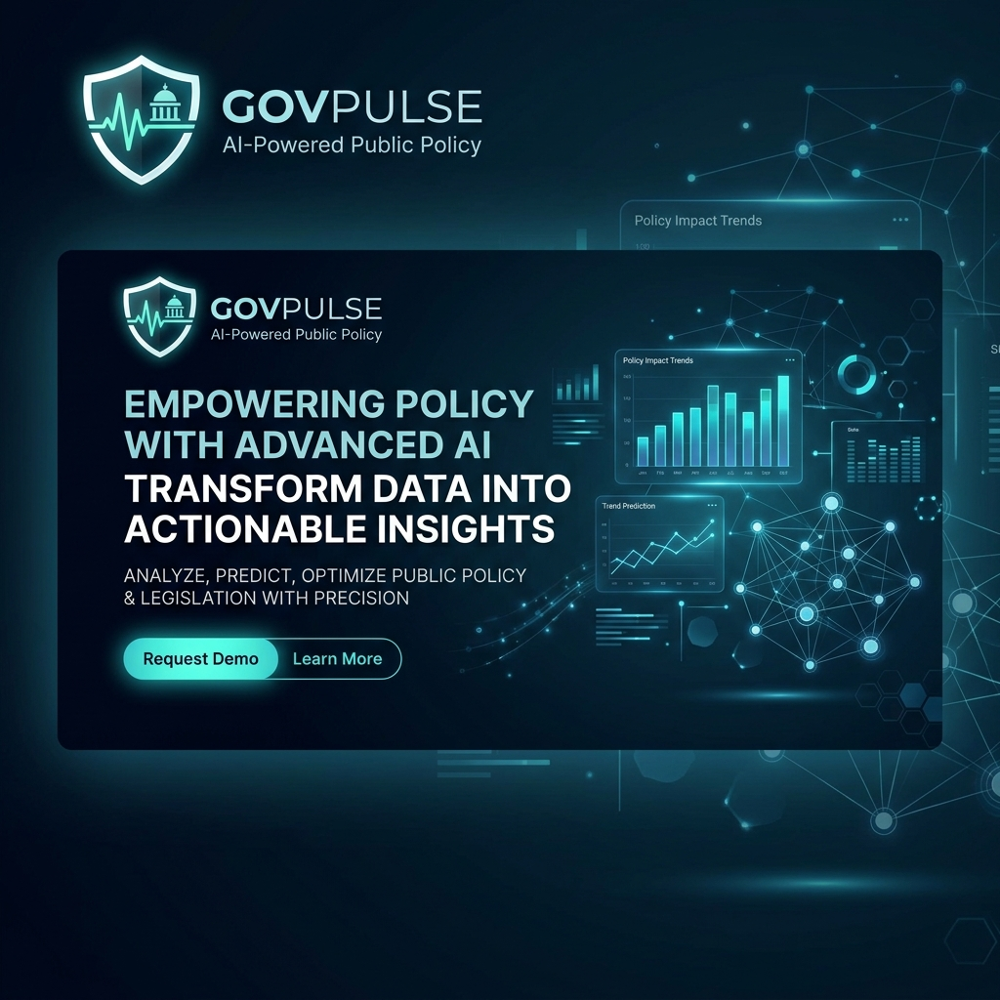

# GovPulse: Advanced Public Policy AI Suite

[](https://www.python.org/)
[](https://fastapi.tiangolo.com/)
[](https://scikit-learn.org/)
[](https://www.docker.com/)

**GovPulse** adalah platform analitik cerdas yang dirancang untuk mendukung pengambilan kebijakan publik berbasis data (*Evidence-Based Policy*). Platform ini mengintegrasikan Machine Learning canggih untuk menganalisis sentimen masyarakat dan mensimulasikan dampak indikator pembangunan secara riil.

---

## 📋 Table of Contents
- [Visi & Misi](#-visi--misi)
- [Metodologi Analisis](#-metodologi-analisis)
- [Fitur Utama](#-fitur-utama)
- [Arsitektur Proyek](#-arsitektur-proyek)
- [Panduan Instalasi](#-panduan-instalasi)

---

## 🎯 Visi & Misi
Membantu pemerintah dan pengambil kebijakan untuk:
1.  **Mendengar**: Memahami opini publik secara objektif melalui NLP (Natural Language Processing).
2.  **Memprediksi**: Menggunakan data historis dunia untuk memproyeksikan skor kesejahteraan.
3.  **Mensimulasikan**: Melakukan uji coba "What-If" terhadap anggaran dan dukungan sosial sebelum kebijakan diterapkan.

---

## 🧠 Metodologi Analisis (6 Tahapan)
Setiap analisis dalam GovPulse mengikuti standar profesional data science untuk kebijakan publik:
1.  **Data Collection**: Integrasi silo data secara otomatis dari internet.
2.  **Data Cleaning**: Validasi data pemerintah, penanganan *missing values*, dan deteksi anomali.
3.  **Descriptive Analysis**: Visualisasi distribusi statistik lapangan (Peta Dunia & Regional).
4.  **Feature Engineering**: Pemilihan variabel strategis (GDP, Social Support, Corruption Index).
5.  **Predictive Modeling**: Pelatihan model dengan Cross-Validation.
6.  **Prescriptive Simulation**: Rekomendasi kebijakan berdasarkan proyeksi dampak numerik.

---

## 🚀 Fitur Utama
- **Public Sentiment Engine**: Klasifikasi aspirasi publik menjadi sentimen positif/negatif.
- **Policy Impact Predictor**: AI untuk prediksi indeks kebahagiaan (Happiness Score).
- **Explainable AI (XAI)**: Transparansi penuh menggunakan *Feature Importance*.
- **Interactive Dashboards**: Visualisasi berbasis Plotly yang dinamis.

---

## 📂 Struktur Proyek
```text
.
├── backend/
│   ├── app/
│   │   ├── api/          # REST API Endpoints
│   │   ├── ml/           # Core AI Engine
│   │   └── services/     # Business Logic Layer
│   └── main.py           # Application Entry Point
├── notebooks/
│   └── governance_ml_experiments.ipynb # Advanced ML Research Suite
└── docs/
    └── assets/           # Project Assets (Logo, Images)
```

---

## 🛠️ Panduan Instalasi

### Prasyarat
- Python 3.10+
- Pip

### Langkah-langkah
1.  **Clone Repository**
    ```bash
    git clone https://github.com/khaiqalsatrio/GovPulse-Advanced-Public-Policy-AI-Suite.git
    cd GovPulse-Advanced-Public-Policy-AI-Suite
    ```
2.  **Instalasi Backend**
    ```bash
    cd backend
    pip install -r requirements.txt
    ```
3.  **Menjalankan Server**
    ```bash
    python main.py
    ```
4.  **Menjalankan Eksperimen (Jupyter)**
    ```bash
    cd notebooks
    jupyter notebook
    ```

---
*Developed for a Better Governance and Evidence-Based Decision Making.*
